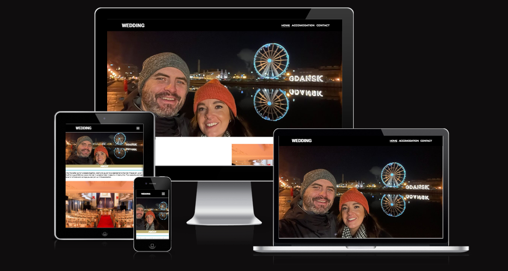
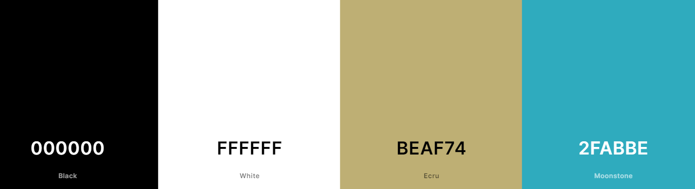
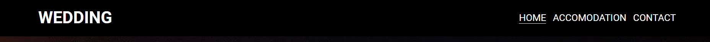
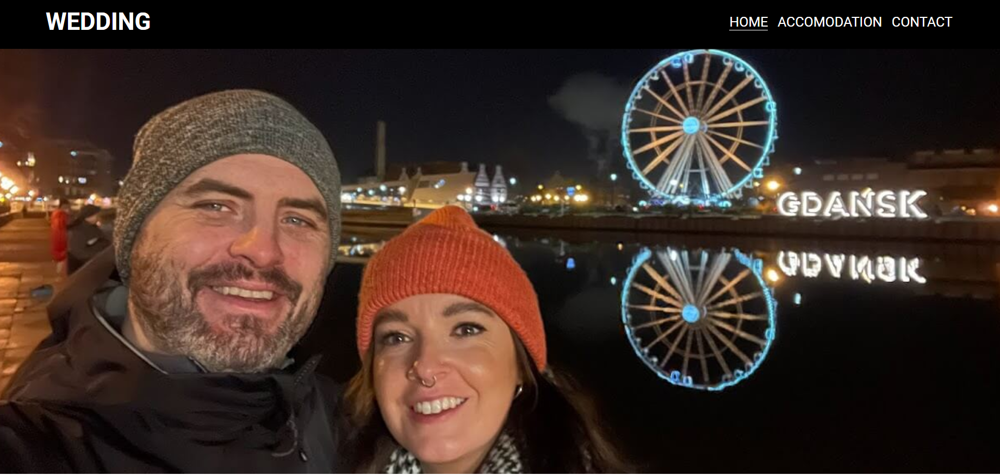
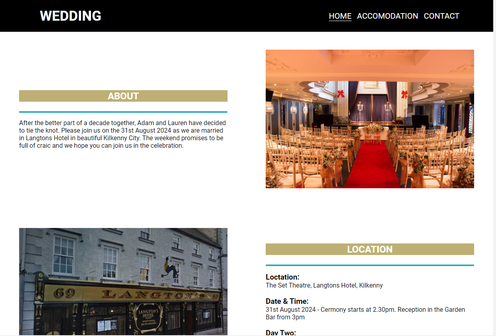
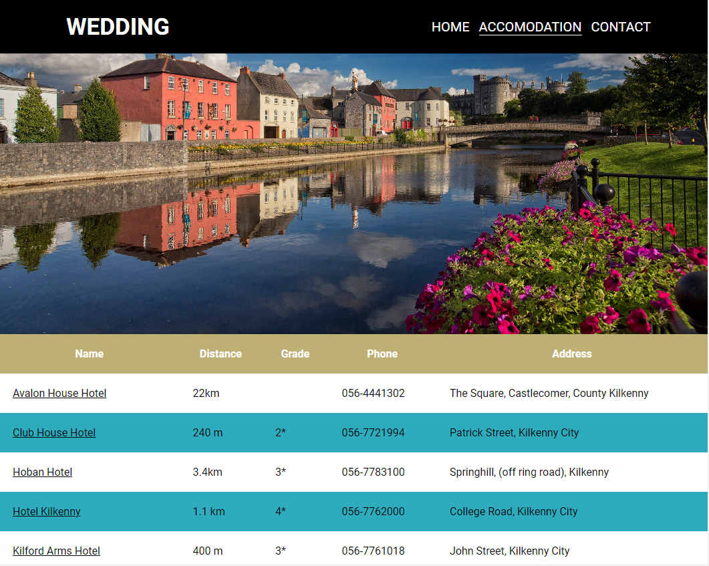
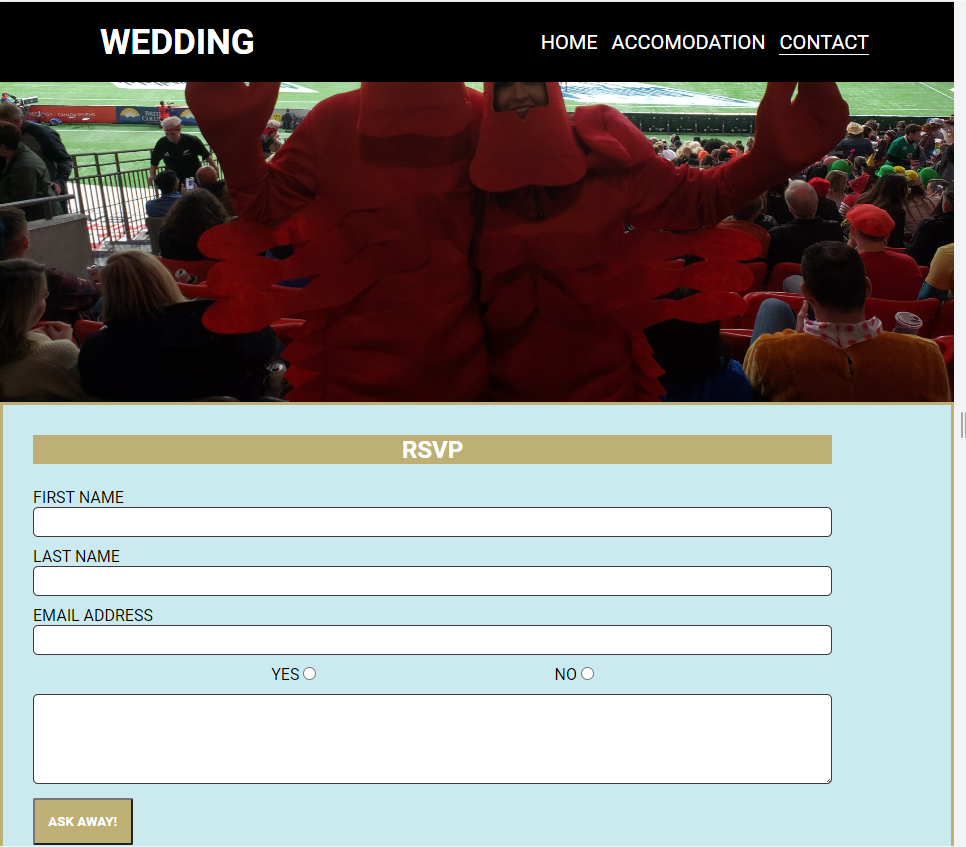
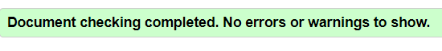
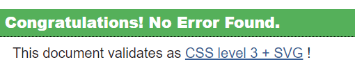
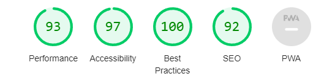

# Adam & Lauren's Wedding
A webite providing information for our wedding happening in August 2024. 

The goal of this website is to provide information to guests about the wedding itself and to help them with getting accomodation in the Kilkenny. 
Thereis also a section to RSVP to the wedding that for now is the custom form dump but will be expanded upon to be operational in the coming weeks. 



This website is curently live and the link to view it can be found here [HERE!](https://akestell.github.io/p1-wedding-website/)


## Table of Contents

- [Adam \& Lauren's Wedding](#adam--laurens-wedding)
  - [Table of Contents](#table-of-contents)
  - [UX](#ux)
    - [Site Purpose:](#site-purpose)
    - [Site Goal:](#site-goal)
    - [Audience:](#audience)
    - [Communication](#communication)
    - [Current User Goals](#current-user-goals)
    - [New User Goals](#new-user-goals)
  - [Design](#design)
    - [Color Scheme](#color-scheme)
    - [Typography](#typography)
    - [Imagery](#imagery)
  - [Features](#features)
    - [Existing Features](#existing-features)
      - [Navigation Bar:](#navigation-bar)
      - [Home Page:](#home-page)
      - [Accomodation Page:](#accomodation-page)
      - [Contact Page:](#contact-page)
      - [Socail Links:](#socail-links)
    - [Future Features](#future-features)
  - [Testing](#testing)
    - [Valicator Testing](#valicator-testing)
  - [Technologies Used](#technologies-used)
    - [Main languages used](#main-languages-used)
    - [Frameworks, Libraries \& Programs Used](#frameworks-libraries--programs-used)
  - [Deployment](#deployment)
  - [Credits](#credits)
    - [Content](#content)


## UX

### Site Purpose:
To give information to guests attending a wedding in Langtons Hotel in Kilkenny Ireland.

### Site Goal:
To give a one stop shop for all information needed for geests of the wedding. As more information around the weekend is confimred it will be added to the site to keep guests as up-to-date as possible. 

### Audience:
Guests attending the wedding and looking to find accomodation in the city.
 
### Communication
The site is designed with the idea of providing the information needed by a user. Eash page is set up to have everthing the user would need on a given page. The goal was to avoid needing to click on multiple links to get the information they need. 

### Current User Goals
To see information about the wedding and accomadation.

### New User Goals
To be easily get around the site and get the information they need for the weekend as clearly as possible. The information needs to be kept up-to-date and help any user on the site to be as informed as possible.

## Design

### Color Scheme
The colour scheme on the site was inspired by the colour scheme on the website of the wedding venue - [Langtons Hotel Kilkenny](https://www.langtons.ie/). 


### Typography
Roboto was the main language used throughout the site that was again to match up with the font used on the Hotel website.


### Imagery
The photos used in the hero section of the Homepage and the Contact page were personal photos. The images used on the other elements were all taken from Langtons Hotel. 

## Features

### Existing Features
#### Navigation Bar:
Can be seen across all pages on the website. Provides links to each page on the site. 



#### Home Page:
A basic diesing on the homepage showing the navbar at the top and hero image directly underneath.



The Information section below is designed to give information about the bride and groom and for details about the ceremony too.



#### Accomodation Page:
Another Hero Image at the top of the page and a table below showing accomodation available in the city that guests can use to find a place to stay. 



#### Contact Page:
Designed to act as a page where guests can RSVP to the wedding directly on the page. Contact form currently leads to Code Institute formdump page but future plans would be to include a custom landing page for real world use. 



#### Socail Links:
Links to the Htoel's social media sites have been added to the footer and are included on eachp page. All icons have been taken from FontAwesome and the design for them is taken from the Love Running project.


### Future Features
Create a custom landing page and database for guests to RSVP directly through the Contact form on the Contact page. 


## Testing
Some issues with sizing on the Accomodatin page when moving to smaller screens. It turned out that the padding and text size were too big and were pushing the hero image out of it's placement. Was able to resolve by writing media queries for differnet size screens and reducing the sice of each to make the hero image fit. 

Similar issue arised when style the hero image on the homepage in that the background image was set incorrectly. Initially it was set to 
```
background-size: 100%;
```
but after testing a couple of things and speaking with one of the tutors, I was able to come to the conculsion the it needed to be cover instead of 100%.

### Valicator Testing
 - html files all went through the [W3C validator](https://validator.w3.org/) with no issues in them. 
  
- css files also passed all tests when ran through [Jigsaw validator](https://jigsaw.w3.org/css-validator/)
  
- Lighthouse test returned a very high rating for the site. In particualr a high Accessability Score
  

## Technologies Used
### Main languages used
- HTML 5
- CSS 3

### Frameworks, Libraries & Programs Used
- Google fonts - Used for the font family 'Roboto' which is used throughout the site.
- Font Awesowe - Each of the social media icons in the footer where taken from there. 
- GitHub - used to store repo for project submission
- Codeanywhere - to create html and css files.
- Icons8.com - Used to obtain the favicon at the top of the page.
- Am I responsive - to make sure the project looked good on all screen sizes. 


## Deployment
The site was deployed to GitHub pages. The steps to deploy are as follows:
- In the GitHub repository, navigate to the Settings tab
- From the source section drop-down menu, select the Master Branch
- Once the master branch has been selected, the page will be automatically refreshed with a detailed ribbon display to indicate the successful deployment.
- The live link can be found [HERE](https://akestell.github.io/p1-wedding-website/index.html)

## Credits

### Content
